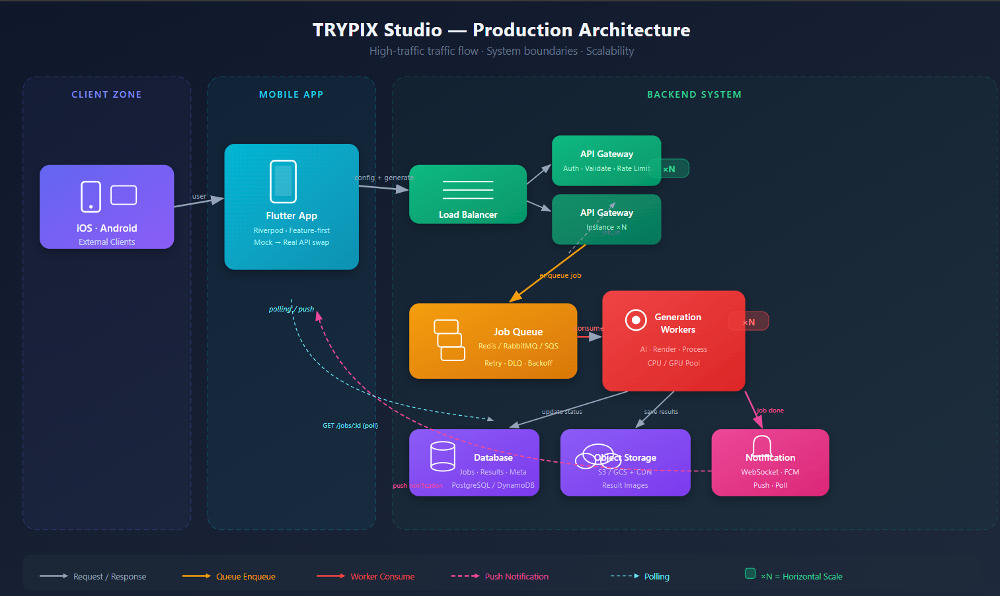

# TRYPIX Studio Page — Mobil Case Study

Flutter ile geliştirilmiş **TRYPIX Studio Page** akışının uçtan uca uygulandığı bir mobil case study. Kullanıcı seçeneklerini yapılandırır, asenkron (mock) üretim başlatır, sonuç listesini görüntüler ve aynı akıştan yeni üretim tetikleyebilir.

> **Bu case study kapsamında tüm üretim süreci tamamen mock’tur.**  
> Uygulama herhangi bir backend, AI servisi veya dış ağ çağrısı yapmaz. Sonuç görselleri yerel gradient placeholder ile gösterilir.

**Platform:** iOS & Android · **State:** Riverpod · **Mimari:** Feature-first · **Veri:** Mock asenkron simülasyon

---

## 1. Proje Özeti

**Studio Page**, tek bir ana sayfa (`StudioPage`) üzerinden state’e göre farklı ekranlar (scope’lar) göstererek ilerleyen bir mobil akıştır:

- **Dashboard:** Sekmeler (Görsel Editörü, Instagram Estetik, Video Editörü, Özel Prompt, Arka Plan Değiştir, Kaydedilen Görseller). Bir sekmeye girilince ilgili editör açılır.
- **Editör:** Kullanıcı ayarları seçer (sayı, stil, açı, manken vb.); **Oluştur** ile üretim başlatılır.
- **Loading:** Tam ekran yükleme; başlık ve adım mesajları (Üretim başlatılıyor… → Ayarlar işleniyor… → İçerik oluşturuluyor…).
- **Results:** Üretilen sonuçların grid’i; bir sonuca tıklanınca detay sayfası (çoklu seçim, indir, tam ekran).
- **Detaydan:** “Tekrar Oluştur” son üretim tipiyle yeni üretim başlatır; “Üretimi Sonlandır” sonuçları temizleyip dashboard’a döner. Alttaki üretim geçmişi çubuğu ile geçmiş üretimlere dönülebilir.

**Kapsam:** Mobil ön yüz, durum yönetimi, kuyruk/asenkron akış simülasyonu, UI/UX tasarımı.  
**Kapsam dışı:** Backend servisleri, gerçek API entegrasyonu, yapay zeka model entegrasyonu.

---

## 2. Durum Yönetimi ve Asenkron Akış

### 2.1 State management (Riverpod)

- **NotifierProvider ile domain state:**
  - **StudioController / StudioState:** Config, `isLoading`, `loadingMessage`, `results`, `selectedResults`, `errorMessage`, `lastGenerationType`. Üretim ve sonuç ekranı için tek kaynak.
  - **GenerationHistoryController / GenerationHistoryState:** Geçmiş üretimler listesi ve seçili üretim; geçmiş çubuğu ve “geçmişten sonuçları aç” davranışı.
  - **SelectedImagesController, SavedResultsController:** Yüklenen görseller ve kaydedilen sonuçlar (bellek içi).
- **Provider ile servis enjeksiyonu:** `generationServiceProvider` → `GenerationService` sağlar; controller `ref.read(generationServiceProvider)` ile kullanır. Testte provider override edilerek deterministik/fake servis verilebilir.
- **StateProvider ile UI bayrakları:** `productionEndedProvider`, `requestedTabProvider` vb.

Okuma: `ref.watch(...)` reaktif UI; aksiyonlarda `ref.read(...)` / `ref.read(...).notifier`. State immutable; güncelleme `state.copyWith(...)` ile.

### 2.2 Mock asenkron üretim

Üretim tamamen **simüle**; gerçek ağ veya kuyruk yok.

- **Tetikleme:** Editörde “Oluştur” → `StudioController.generate(type)` çağrılır.
- **Controller akışı:**
  1. `isLoading: true`, ilk `loadingMessage` (Üretim başlatılıyor…).
  2. Kısa sabit gecikmelerle mesajlar güncellenir: Ayarlar işleniyor… → İçerik oluşturuluyor…
  3. **GenerationService** ile `service.generate(config.count)` çağrılır; servis 2–6 sn (veya testte sabit) gecikme sonrası `List<GenerationResult>` döner.
  4. Başarıda: `results` atanır, `isLoading: false`, kayıt geçmişe eklenir.
  5. Hata: Servis exception fırlatırsa controller `errorMessage` ile hata ekranı gösterir; yeniden deneme aynı controller metotlarıyla yapılır.

**GenerationService** constructor’da `enableRandomFailure`, `fixedDelay`, `failureChance` alır; testte deterministik davranış için override edilir.

### 2.3 UI/UX geri bildirimleri

- UI `ref.watch(studioControllerProvider)` ile state’i izler: loading iken `StudioLoadingScope`, hata iken `StudioErrorScope`, sonuç varken `StudioResultsScope` (ve gerekirse detay sayfası) render edilir.
- Loading → Results geçişinde kısa fade; başarıda snack bar (“İçerik hazır 🎉”).
- Platform hissi: iOS’ta loading/error butonları Cupertino, Android’de Material.

---

## 3. Kurulum ve Çalıştırma

**Gereksinimler:** Flutter SDK (^3.9.0), Android Studio / Xcode (platform build için).

```bash
# Bağımlılıkları yükle
flutter pub get

# Uygulamayı çalıştır (bağlı cihaz/emülatör)
flutter run
```

Splash sonrası varsayılan route Studio dashboard’dur.

**Release build:**

```bash
# Android
flutter build apk
# veya
flutter build appbundle

# iOS
flutter build ios
```

**Test:**

```bash
flutter test
```

---

## 4. Klasör Yapısı

Minimal örnek; feature-first yapı:

```
lib/
├── main.dart
├── core/
│   ├── router/
│   │   └── app_router.dart
│   └── theme/
│       ├── app_theme.dart
│       └── theme_mode_provider.dart
└── features/
    ├── splash/
    │   └── presentation/
    │       └── splash_screen.dart
    └── studio/
        ├── data/
        │   ├── generation_service.dart
        │   └── models/
        │       ├── generation_config.dart
        │       ├── generation_result.dart
        │       └── generation.dart
        ├── presentation/
        │   ├── pages/
        │   │   ├── studio_page.dart
        │   │   └── studio_results_detail_page.dart
        │   └── widgets/
        │       ├── bars/
        │       ├── common/
        │       ├── editors/
        │       │   ├── shared/          # Ortak: scaffold, section, action bar, image upload, modal
        │       │   ├── visual_editor/
        │       │   ├── instagram_editor/
        │       │   ├── video_editor/
        │       │   ├── custom_prompt/
        │       │   ├── background_editor/
        │       │   └── studio_configuration/
        │       ├── results/
        │       └── studio_scopes/       # Loading, error, results, empty, saved
        └── state/
            ├── generation/              # StudioController, GenerationHistory, service provider
            ├── saved/
            ├── selection/
            └── ui/                      # Constants, UI providers
```

- **core:** Router, tema; feature’lardan bağımsız.
- **features/studio:** data (servis + modeller), presentation (sayfalar + widget’lar), state (Riverpod).

---

## 5. Dependencies / Paketler

| Paket | Açıklama |
|-------|----------|
| **flutter_riverpod** ^2.6.1 | State management: Notifier/Provider ile tek kaynak state, testte override. |
| **image_picker** ^1.1.2 | Galeri/kamera seçimi; editörlerde görsel yükleme. |
| **video_player** ^2.9.2 | Splash / tanıtım videoları. |
| **cupertino_icons** ^1.0.8 | iOS tarzı ikonlar. |

**Dev:** `flutter_test`, `flutter_lints` ^5.0.0.

---

## 6. Opsiyonel: Yüksek Trafikli Üretim Ortamı İçin Mimari

Case study’de tüm süreç mock’tur. **Gerçek production’da** mobil uygulama → backend → üretim servisi akışı aşağıdaki gibi kurgulanabilir.



### 6.1 Akış (Mobile → Backend → Generation)

1. Mobil uygulama kullanıcı yapılandırmasını (config, tip, sayı vb.) backend API’ye gönderir.
2. Backend isteği doğrular, kimlik/limit kontrollerini yapar ve üretim işini **senkron yanıt beklenmeden** bir kuyruğa (job queue) yazar; istemciye hemen bir **job id** döner.
3. Ayrı bir **generation service** (worker’lar) kuyruğu tüketir: AI/rendering işini yapar, sonuçları depoya yazar ve işin durumunu “tamamlandı” olarak günceller.
4. İstemci **polling** (job id ile periyodik status API) veya **push** (WebSocket / FCM) ile sonucu öğrenir; hazır olunca sonuç listesi ve URL’ler çekilir.

Böylece uzun süren üretim HTTP isteğini bloke etmez; backend ve generation servisi birbirinden bağımsız ölçeklenebilir.

### 6.2 Yüksek trafik için önerilen teknolojiler ve stratejiler

- **API katmanı:** Stateless; sadece istek kabul, doğrulama ve kuyruk yazma. **Yatay ölçekleme:** Load balancer + çoklu API instance.
- **Job queue:** **Redis Queue**, **RabbitMQ**, **AWS SQS**, **Google Cloud Tasks** — üretim isteklerinin kaybolmadan sırayla işlenmesi; retry (dead-letter queue, exponential backoff).
- **Generation worker’lar:** Kuyruktan iş alan, ağır işi (AI, render) yapan servisler. Worker sayısı kuyruk derinliğine göre ayarlanır; CPU/GPU yoğun işler ayrı pool’larda.
- **Depo:** Sonuçlar ve meta veri için **DB** + **object storage** (S3, GCS); API ve worker’lar sadece bu depoyu okur/yazar.
- **İstemci bildirimi:** **Polling** (GET /jobs/:id veya /generations/:id) veya **push** (WebSocket, **FCM**) ile “job completed” bildirimi.
- **Mobil tarafta:** Mevcut “loading mesajları” ve “sonuçlar hazır olunca ekran” davranışı, production’da bu async job + status/push modeline bire bir karşılık gelir; ek olarak job id ile durum sorgulama ve push dinleme eklenir.

---

## 7. Değerlendirme Kriterleri (Case Study Referansı)

README, case study’de belirtilen kriterlere göre kısa referans:

| Kriter | Durum |
|--------|--------|
| Kullanıcı seçeneklerini yapılandırma | Editörler (Görsel, Instagram, Video, Özel Prompt, Arka Plan) ile config seçimi; StudioController.updateConfig. |
| Generate ile üretim başlatma | “Oluştur” butonu → StudioController.generate(type). |
| Asenkron mock üretim süreci | GenerationService: Future.delayed + List<GenerationResult>; loading mesajları controller’da. |
| Birden fazla sonuç listesi | StudioState.results → grid; GenerationHistory ile geçmiş listesi. |
| Sonuç detaylarını görüntüleme | StudioResultsDetailPage: seçim, indir, tam ekran, alt aksiyonlar. |
| Yeni üretim başlatabilme | “Tekrar Oluştur” (son tip ile); yeni editör seçimi → Oluştur. |
| Durum yönetimi | Riverpod (NotifierProvider, Provider, StateProvider); immutable state, ref.watch/ref.read. |
| UI/UX geri bildirimleri | Loading scope, error scope, snack bar, platform-aware butonlar (Cupertino/Material). |
| Kapsam dışı (backend, API, AI) | Tüm veri mock; ağ çağrısı yok. |

---

## Teknoloji Özeti

- **Flutter** SDK ^3.9.0  
- **flutter_riverpod** — state management  
- **image_picker** — galeri/kamera  
- **video_player** — splash / video  
- **Mimari:** Feature-first (core + features/studio: data, presentation, state)  
- **Platform:** iOS & Android (Material + seçili Cupertino kullanımı, SafeArea)

Case study teslimi için akış özeti, asenkron yaklaşım, Riverpod kullanımı, mock servis mantığı, kurulum, klasör yapısı, bağımlılıklar, opsiyonel production mimarisi ve değerlendirme kriterleri yukarıda özetlendi.
